# **Interactive Sumerian Hosts using Voice based Feedback mechanism (****Alexa****)**

**Purpose:**
You will learn how simple and seamless it is to build an interactive and immersive Human-like Sumerian Hosts(without having to touch or press any button) on their AR/VR applications using Alexa. 

**Introduction:**
We are going to build a Sumerian host that answers your questions regarding AWS services, and uses TV to display videos about these services.  We can ask the host to display content on TV directly, or ask about any AWS service or interrupt the Host at any point of time while she is explaining about a topic and ask further questions. This makes the Host more human like and interactive as she can listen to you when interrupt her and take cross questions. 

**Architecture**:

We can use Alexa, making use of its NLP/NLU capabilities and integrate it further with Sumerian through Lambda and SQS/IoT/DynamoDB(DynamoDB in this context).
Sumerian Scene keeps scanning the messages from DynamoDB and take the appropriate action based on the information it receives from Alexa skill through DynamoDB.
It can take appropriate action in the scene like switching off TV, interrupting a HOST and so on.
For simplicity, let’s consider 2 simple actions:
1. Stop or interrupt a host (Eg: “Stop/ Stop the host” should stop the host and let the host ask us for a followup question)
2. Play or stop a video on tv (Eg: “Show Lambda” should bring up a small video about Lambda on TV and “Stop” should clear the TV and ask for a followup question)

**Steps:**

1. Alexa Skill has to be built that can integrate with Lambda and push the user’s voice inputs.
2. Lambda functions to take appropriate actions as per the user’s voice inputs. One function for Persisting the input data on to Dynamo DB. Another to let Lex bot read data from Dynamo DB.
3. Two Dynamo DB tables to persist transactional(user inputs) and QnA data
4. Lex Bot
5. Sumerian Scene

**1. Creating an Alexa Skill:**

Log into your alexa developer console ([_https://developer.amazon.com/alexa/console/ask_](https://developer.amazon.com/alexa/console/ask)) and click on create skill.  
Enter Skill name as “InteractiveSumerianHost” or any name as per your liking. 

With all other options set to their default values, click on Create Skill. 

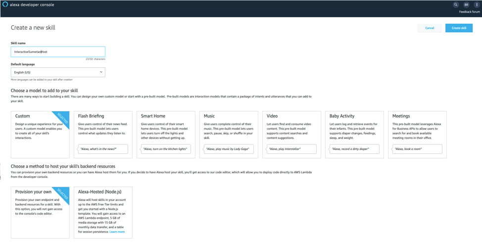
Choose “Start from scratch” option and click choose. This takes you to skills page. 

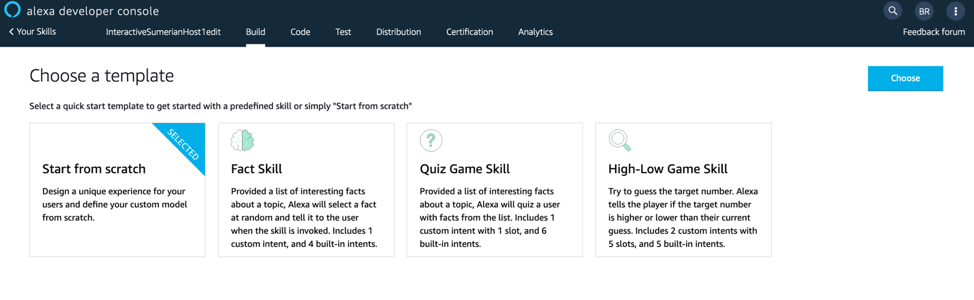
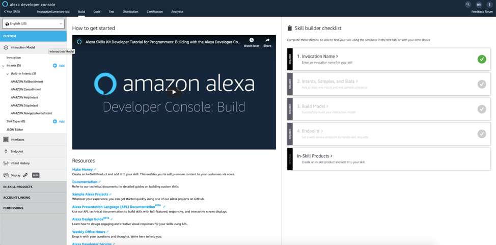
In the Skill screen, on the left panel, you can notice Invocation option, click that and change the skill invocation name to something simple(we will use the name 'sumerian'). \ And click ‘Save Model’.
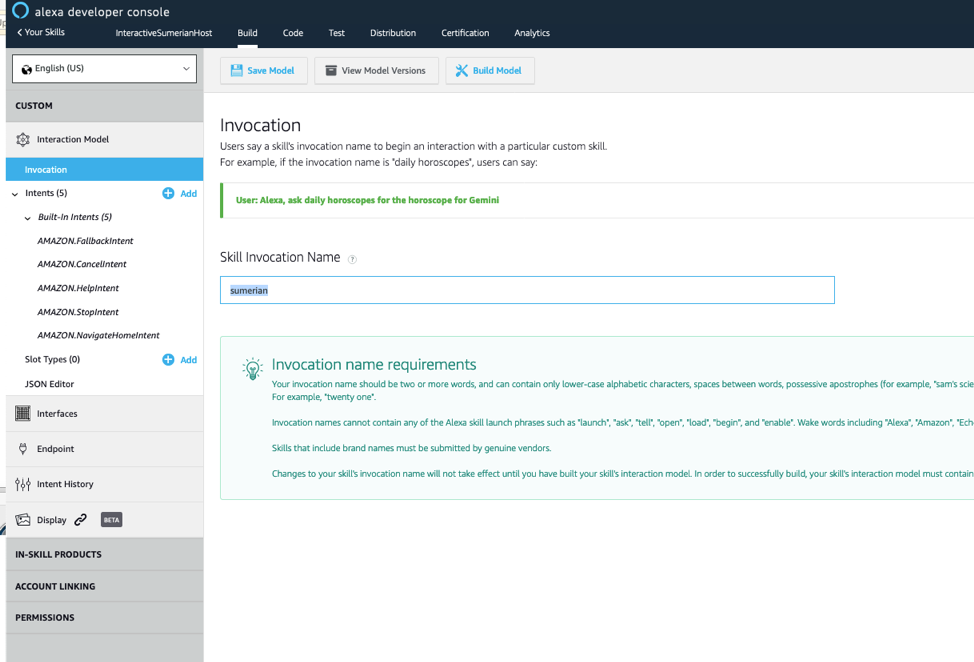
Choose ‘Slot Types’ on the left panel and create two slot types 1.action and 2.service. 

To create, click on ‘+ Add’ button on Slot Types. Create custom slot type with name “action” and add slot values(‘display’, ‘show’, ‘pause’, ‘stop’) as per the image below:
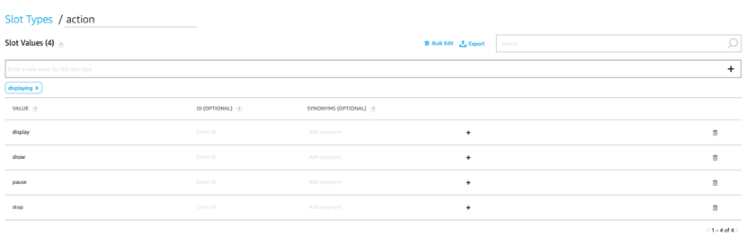
And repeat same step to create the slot type “service”
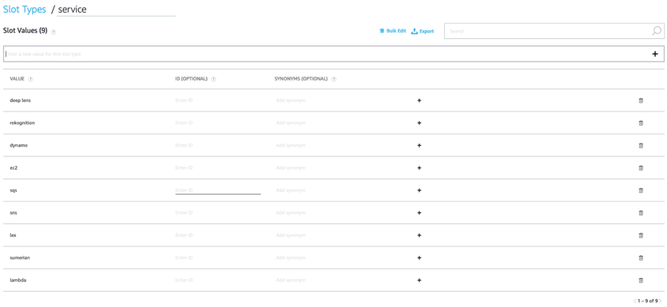 

Now choose Intents and click “Add Intent”.
 
Create a new intent with the name “stop_sumerian_host” and add the slot type “action” on intent slots.
 
Now add sample utterances. While creating an utterance, add the slot type to it where ever required(Eg: you can see that the utterance ‘*{action} the Sumerian host*’ have slot value action being added into it in a curly brackets).
 
Then click the ‘+’ button on the right to sate it to the utterances list.
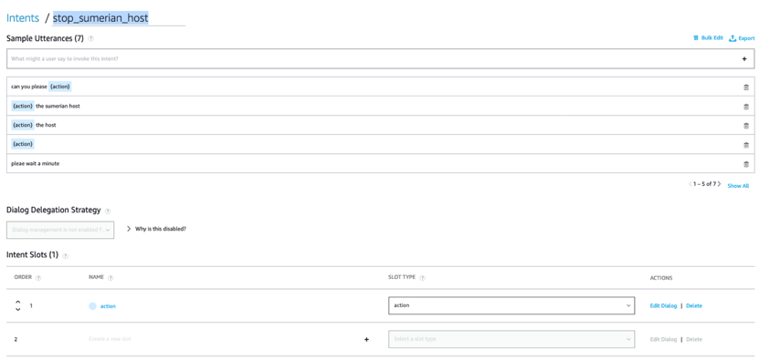

Now add another intent “show_on_tv” as per the image below:
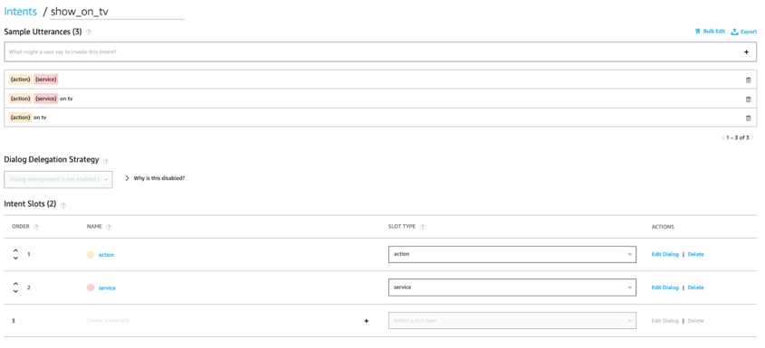

Now select “Endpoint” tab in the left panel and choose AWS Lambda ARN and note “your skill id”. You will need to use it in Lambda function later.

Note: You also need to copy the Lambda function ARN later (from Lambda console) and paste that under Default region in this screen.

Now save the model and build it. These options are available on the top of the screen. Then you can test the skill from Utterance Profiler.

**2. Creating Lambda Functions:**

Log into Lambda console. Click on Create Function. Choose ‘Author from scratch’, Runtime as Node.js latest version, and give a logical Function name and choose Create new role under permissions. 

Then click Create Function.
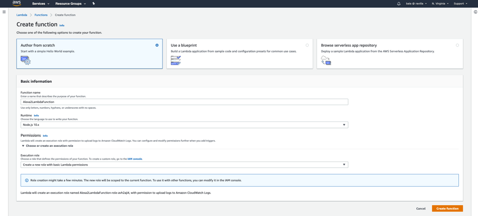

Now create a new file as shown in below screen and name it package.json
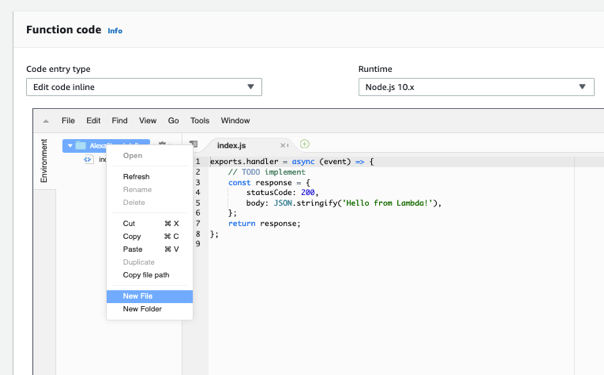

In **package.json**, paste the code snippet from the file **LambdaFunction1/package.json**:

Similarly, create another file named **skill.json**:
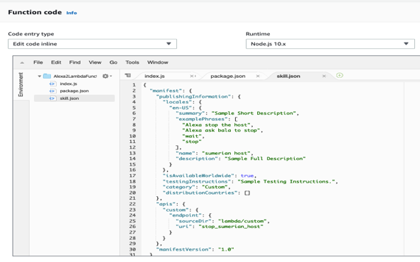

Code Snippet from **LambdaFunction1/skill.json**

Replace the code in **index.js** to the code in **LambdaFunction1/index.js**

Now Under Lambda Designer, click on + Add Trigger button. And choose Alexa Skills Kit and add the Skill ID that is noted in the last step while creating alexa skill.
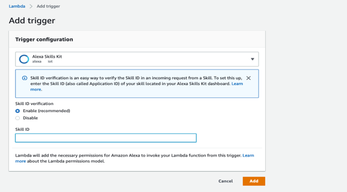

Save your work and copy the ARN of this lambda function. Paste the ARN in the Alexa developer portal under Default region Endpoint and save it.

Now go to AWS IAM and add Amazon DynamoDB admin access permissions to the execution role we attached to Lambda Function.

Now let’s create another Lambda Function to log Lex bot intents.

Click Create Function and choose ‘Author from scratch’, Runtime as Node.js latest version, and give a logical Function name(Eg:LexLogLambda) and choose Create new role under permissions. Then click Create Function. 

Don’t forget to give this new role permission to access DynamoDB (You can add this permission in AWS IAM for this role) .

Now add two Environment Variables([PRIMARY_KEY,LexLogId] and [TABLE_NAME,LexLog]) to the function as shown in the image below:
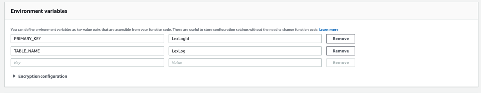

Now create the following files:
* **package.json** from **LambdaFunction2/package.json:**
* **Index.js** from **LambdaFunction2/index.js:**
* **package-lock.json** from **LambdaFunction2/package-lock.json:**

Optionally, you can also copy the tests folder into your lambda function.

**3. Creating DynamoDB tables:**

We will create two dynamodb tables, one to store the user input temporarily and another for Lex’s Q&A data.

Log into DynamoDB dashboard([_https://console.aws.amazon.com/dynamodb/home_](https://console.aws.amazon.com/dynamodb/home)) and click Create Table. 

Fill in the details(Table Name: ‘SumerianAlexaDemo’ and Partition Key: ‘id’) as shown below in the image and click Create.
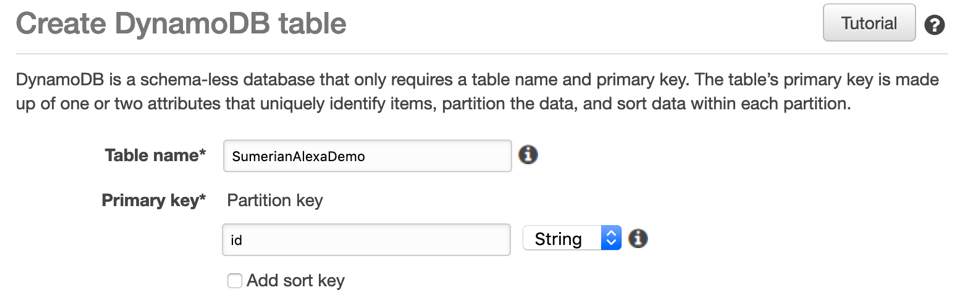

This table will be used to store the user inputs temporarily so that Sumerian can scan through this table and take appropriate action in the scene.

Now create another table for Lex to read Q&A data about AWS services from. Let's name it LexLog with Primary key ‘LexLogId(String).

Fill this table with sample data as per your Q&A usecase. Sample AWS services data is given in the file DynamoData.md.

**4. Creating Lex Bot:**

Now log into Lex console and click on “Create” to create a Bot. Then select Custom bot and fill in the details required as per the image and click Create.
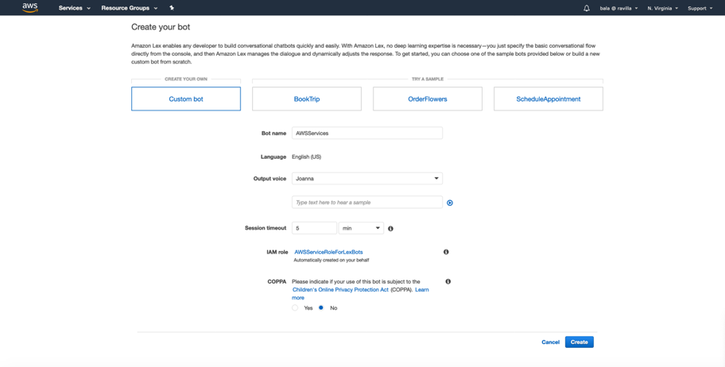

Now Click on ‘Create Intent’ button and select Create Intent. Now give your intent a logical name (getServiceInfo). Save the intent.
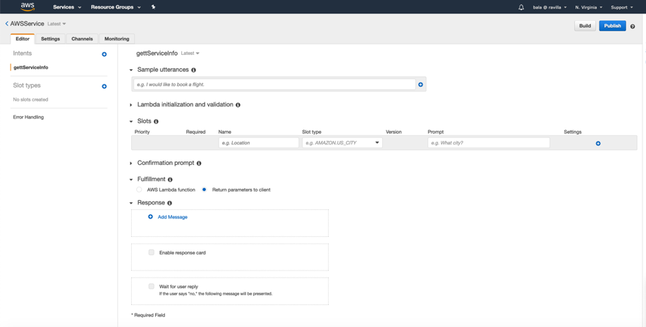

Click on + button on Slot Type in the left panel and add the details as per the image.
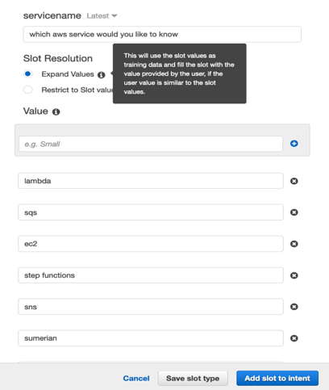

Now add utterances as per the image below.
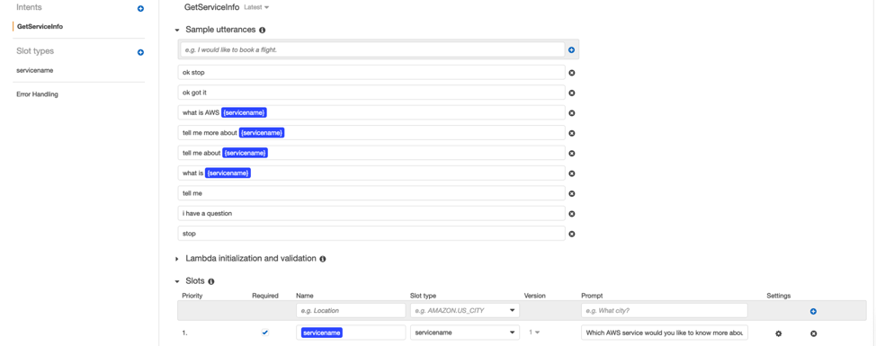

Scroll down, expand Fulfillment and select AWS Lambda function and choose the lambda function we created for Lex.
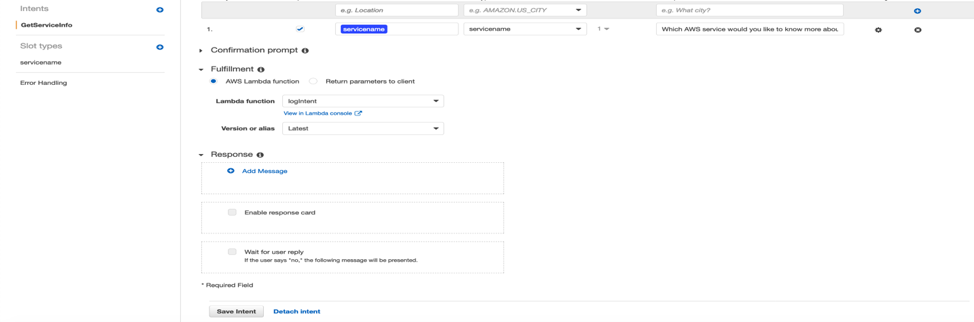

Now save the intent and click on Build button on the top of the screen. On successful build, you can test the bot from the Test bot interface on the right.

Now, click on Publish button and create an alias and click publish. Note down Bot name and Alias.
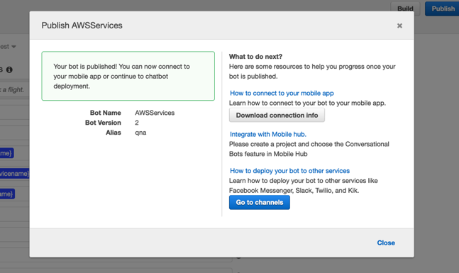

Test if the bot is invoking the Lambda function to fetch the service data from DynamoDB.

**5. Creating Sumerian Scene:**

Download the zip file provided and keep it ready. (with Bundled zip file of the Scene)
Log into Sumerian and click on Create Scene. Give it a name “SumerianDemo” and click Create.
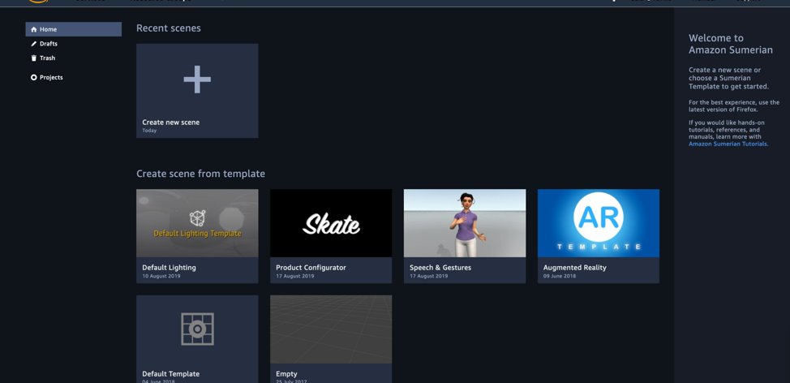
Once the scene is loaded, click on ‘Import Assets’ and choose the downloaded zip file. As soon as the scene is uploaded, save it.
Now, expand room_ViewRoom.fbx and select Maya TShirt. On the right hand side, expand Dialogue component and fill the Lex Bot details copied in previous step. Save the scene.
On the left hand top corner, select ‘Tools’ and click ‘Text Editor’. A pop up opens up the files view. Click ‘Html3d Entity’ and edit it as per your choice. This is the code that represent the TV screen. Remove the button ‘This is HTML’ in this.
Now select script and start editing it as required to control the behavior of voice inputs from the users.
**Note: **
On the Host, the final State Machine would look like:
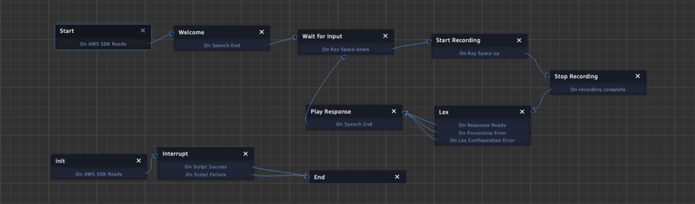
Testing the Scene:
Your host is ready to be tested. Play the scene. You will likely be prompted to allow Sumerian to use your microphone. With the scene in play mode, press the spacebar and use the correct utterance to initiate the chatbot. Respond to Cristine’s questions with phrases that are registered for the given slots. If you used a sample Lex bot, be sure to look at the library of responses that register with the bot in use.
**Summary:**
This demo is just to showcase the art of possibility, readers can further build such solution to interact with the hosts or characters in the scene and interrupt them as needed using Amazon Alexa with Sumerian. These solutions can also let Host control the objects and their state in a scene just by interacting with it.
With voice based feedback mechanism, readers can build a conversational interface for their Host that allows hosts to understand and respond to users’ speech and actions. It has huge potential in creating interactive, engaging live experiences and delight the consumers.

## License

This library is licensed under the MIT-0 License. See the LICENSE file.

